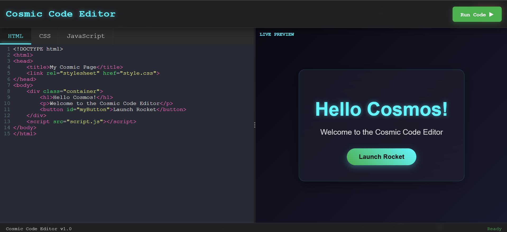

# 🌌 Cosmic Code Editor

 <!-- Add a screenshot or GIF if available -->

A beautiful, interactive online code editor with cosmic-themed animations and real-time preview functionality. Perfect for web development prototyping and learning.

## ✨ Features

- **Tri-pane Editor**: Edit HTML, CSS, and JavaScript simultaneously
- **Real-time Preview**: See changes instantly as you code
- **Cosmic Visuals**: Animated starfield background with twinkling stars and comets
- **Responsive Design**: Works on both desktop and mobile devices
- **Authentication Flow**: Secure login system before accessing the editor
- **Modern UI**: Sleek interface with glassmorphism effects
- **Code Autocomplete**: Intelligent suggestions for faster coding

## 🚀 Getting Started


### Installation
1. Clone the repository:
   ```bash
   git clone https://github.com/your-username/cosmic-code-editor.git
   ```
2. Open `index.html` in your browser to start with the login page

### GitHub Pages Deployment
1. Push your code to a GitHub repository
2. Go to Settings > Pages
3. Select the main branch as the source
4. Wait for deployment to complete (typically takes 1-2 minutes)

## 🔐 Authentication
- **Default Credentials** (for demo purposes):
  - Username: `admin`
  - Password: `password123`
- Users are stored in browser's localStorage
- New users can register via the Sign Up link


## 🎨 Customization
You can easily customize:
- Color scheme in `style.css`
- Background animations in the cosmic-bg script
- Default code templates in the editor initialization


